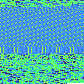

# Memcat - print your program's entire address space

This little program, for windows mac and linux, will print your program's entire address space (your program's memory), can be useful for searching something or in conjunction with pipeview for visualization.

# Usage

```shell
git clone https://github.com/cauefcr/memscroll.git
cd memscroll/memcat
go build . # or go install . to make it available to your PATH
# print some memory!
memcat memcat
# combine with pipeview for a more interesting visualization
memcat firefox | pipeview > /dev/null
```
# Pipeview - pipe data visualizer

Transform your piped data into pretty pictures using the turbo colormap.

# Usage

```shell
git clone https://github.com/cauefcr/memscroll.git
cd memscroll/pipeview
go build . # or go install . to make it available to your PATH
#pipe your data into pipeview!
cat /dev/urandom | head | pipeview > /dev/null
# combine with memcat for a more interesting visualization
memcat firefox | pipeview > /dev/null
```

# Screenshots



^pipeview's source


^pipeview's binary


^cosmopolitan libc's .a file


^A random pdf


^A song in .webm