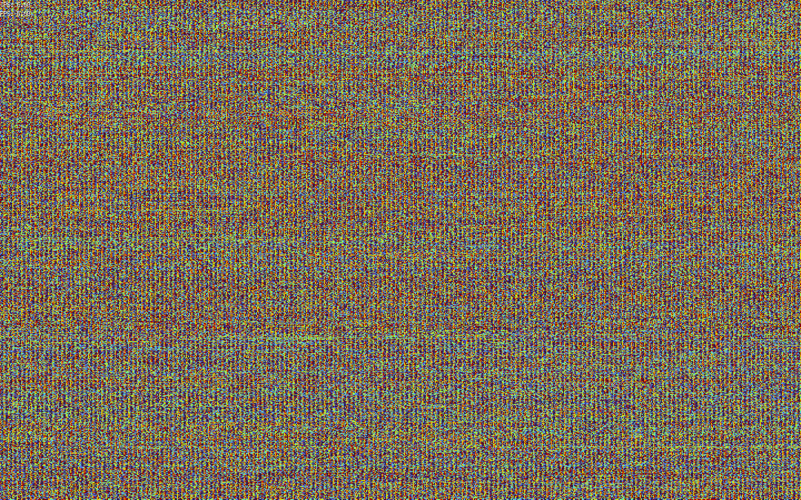
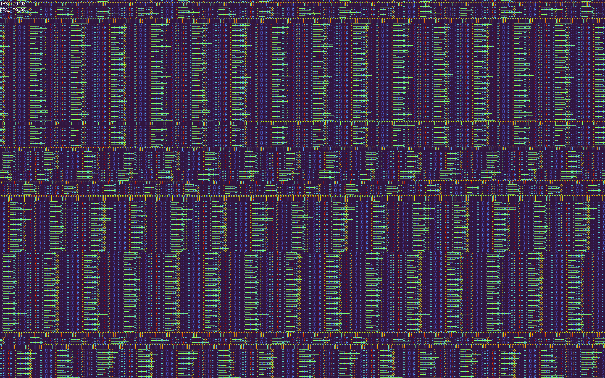
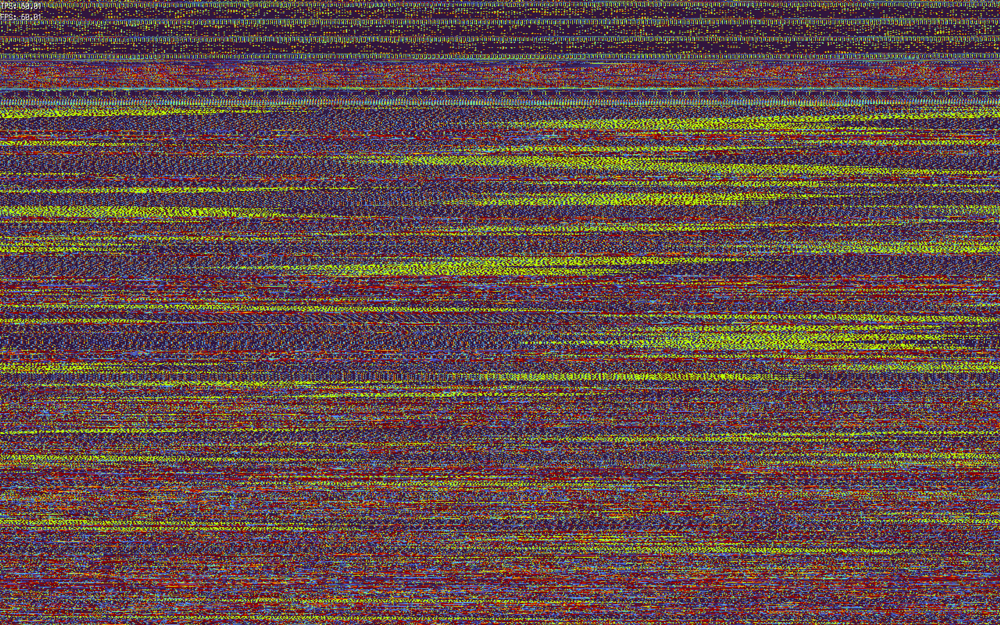

# MemScroll
program memory to scrolling colorful pixels

# Screenshots





# Usage 
```shell
git clone https://github.com/cauefcr/memscroll.git
cd memscroll
go build .
sudo ./memscroll programname # dont look at memscroll itself with it
```
